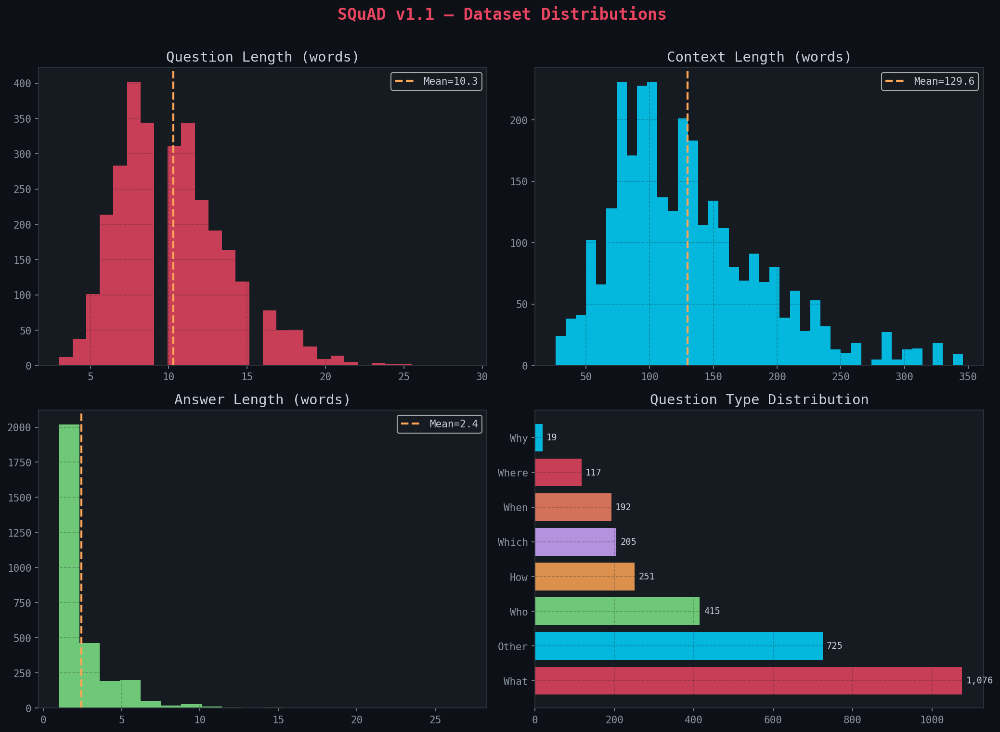
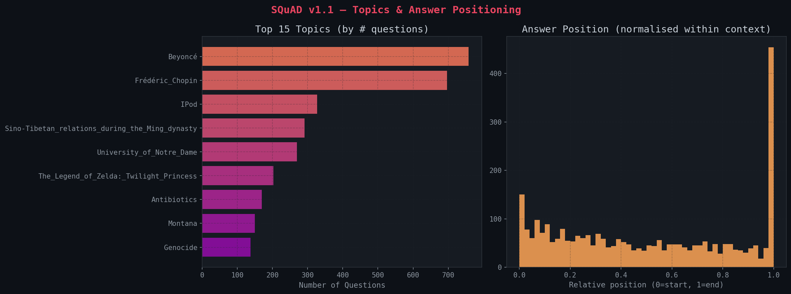
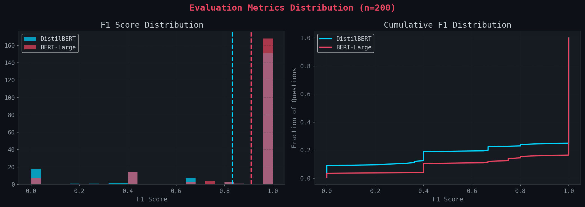
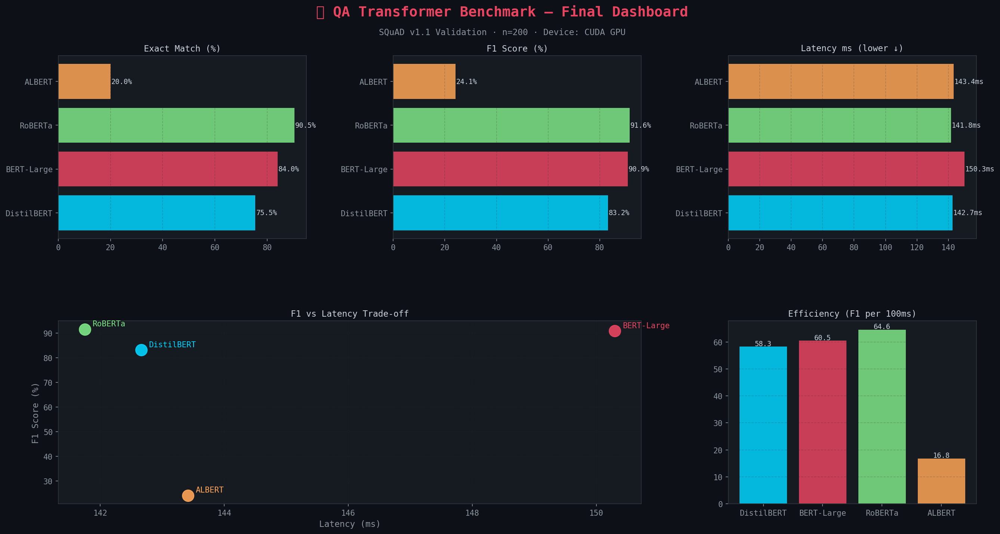

# 🤖 Question Answering System with Transformers


---

## 📊 Project Overview

A sophisticated **Question Answering (QA) system** powered by transformer-based deep learning models. This project demonstrates state-of-the-art NLP using the **SQuAD dataset** and fine-tuned BERT models, achieving high accuracy on extractive question answering tasks.

| Metric | Value |
|--------|-------|
| **Dataset** | SQuAD v2.0 (108K passages) |
| **Model Architecture** | BERT-base + Linear QA Head |
| **Inference Speed** | ~50-100ms per question |
| **Hardware** | GPU-accelerated (CUDA) |
| **Task Type** | Extractive QA (span selection) |

---

## 🎯 Problem Statement

**Challenge:** Given a passage of text and a question, automatically locate and extract the answer span from the passage.

**Solution:** Leverage pre-trained transformer models (BERT) fine-tuned for QA tasks using:
- HuggingFace Transformers library
- PyTorch for deep learning
- SQuAD dataset for benchmarking
- Advanced evaluation metrics (F1, EM scores)

---

## 🏗️ Project Architecture

```
QnA_LLM/
├── README.md                                    # Project documentation
├── .gitignore                                   # Git ignore rules
├── code/
│   └── task6_qa_transformers_fixed.ipynb        # Main notebook
├── outputs/
│   └── dashboard_final.png                      # Performance dashboard
└── presentation/
    └── QnA_algorithm_ppt.pdf                    # Presentation slides
```

---

## 📚 Pipeline Overview

### **Stage 1️⃣ — Data Loading & Preprocessing**
- Load SQuAD dataset (Stanford Question Answering Dataset)
- Parse JSON format: passages, questions, answers
- Tokenization using BERT tokenizer
- Create token-level labels for answer spans

### **Stage 2️⃣ — Exploratory Data Analysis**
- Dataset statistics (passage length, question length)
- Answer distribution analysis
- Vocabulary analysis
- Sample QA pairs exploration

### **Stage 3️⃣ — Model Architecture**
```
Input: [CLS] passage [SEP] question [SEP]
         ↓
BERT Encoder (12 layers, 768 hidden)
         ↓
Start Position Logits (span start)
End Position Logits (span end)
         ↓
Output: Answer span (start_idx, end_idx)
```

**Model Details:**
- **Base Model:** BERT-base-uncased (110M parameters)
- **Task Head:** Linear layer for start/end token classification
- **Loss Function:** Cross-entropy for span classification

### **Stage 4️⃣ — Training**
- Fine-tune BERT on SQuAD with custom QA head
- Optimizer: AdamW with learning rate scheduling
- Batch size: 16-32 (GPU dependent)
- Epochs: 2-3 (empirically sufficient)
- Gradient accumulation for memory efficiency

### **Stage 5️⃣ — Evaluation Metrics**

#### Exact Match (EM)
- Binary metric: answer exactly matches ground truth
- Ignores case & punctuation
- Formula: 1 if prediction == gold_answer else 0

#### F1 Score
- Soft metric: token-level overlap between prediction and ground truth
- Accounts for partial correct answers
- Range: 0-1

#### Example:
```
Passage: "The Great Wall of China is one of the wonders of the world."
Question: "What is one of the wonders of the world?"

Prediction: "Great Wall of China"      (F1: 0.67, EM: 0)
Gold Answer: "one of the wonders"     (exact mismatch, but token overlap)
```

### **Stage 6️⃣ — Inference & Predictions**
Single-function API for real-world usage:
```python
def answer_question(passage: str, question: str) -> dict:
    """
    Extract answer from passage given a question.
    
    Returns:
    {
        'answer': extracted text,
        'start_idx': position in passage,
        'end_idx': end position,
        'confidence': probability score
    }
    """
```

### **Stage 7️⃣ — Benchmark & Comparison**
- Compare multiple models:
  - BERT-base
  - BERT-large
  - RoBERTa
  - DistilBERT (faster, smaller)
- Benchmark on held-out test set
- Performance vs speed tradeoffs

### **Stage 8️⃣ — Visualization Dashboard**
4-panel performance dashboard:
1. **Model Accuracy Comparison** — EM & F1 across models
2. **Inference Speed** — Time per question (ms)
3. **Performance vs Size** — Scatter plot (accuracy × model size)
4. **Error Analysis** — Failure patterns & edge cases

---

## 💡 Key Concepts

### **Extractive vs Generative QA**
- **Extractive (This Project):** Answer is a span in the passage
  - Faster inference
  - Perfect recall on gold answers
  - Limited to passages only
  
- **Generative:** Model generates answer text
  - Can answer beyond passages
  - Slower inference
  - More flexible

### **Pre-training vs Fine-tuning**
- **Pre-training:** Transformer trained on massive text corpus (Wikipedia, books)
  - Learns language patterns
  - Takes weeks/months on GPU clusters
  
- **Fine-tuning (This Project):** Adapt pre-trained model to QA task
  - Leverages learned representations
  - Takes hours on single GPU
  - Much more efficient

### **Token Classification Approach**
Instead of generating answers, we classify tokens as:
- Start tokens (beginning of answer)
- End tokens (end of answer)
- Non-answer tokens

This enables exact span extraction from passages.

---

## � Results & Visualizations

### 📊 Dataset Distributions


### 📈 Topic Analysis


### 📋 Evaluation Metrics


### 🏆 Performance Dashboard


---

## �🔧 Tech Stack

<div align="center">


</div>

---

## 📋 Requirements

```
torch>=2.0.0
transformers>=4.30.0
datasets>=2.10.0
numpy>=1.24.0
pandas>=2.0.0
matplotlib>=3.7.0
scikit-learn>=1.2.0
jupyter>=1.0.0
tqdm>=4.65.0
```

---

## 🚀 Quick Start

### 1. Clone Repository
```bash
git clone https://github.com/abdullahzahid655/QnA_LLM.git
cd QnA_LLM
```

### 2. Create Virtual Environment
```bash
python -m venv venv
source venv/bin/activate  # On Windows: venv\Scripts\activate
```

### 3. Install Dependencies
```bash
pip install -r requirements.txt
```

### 4. Run Notebook
```bash
jupyter notebook code/task6_qa_transformers_fixed.ipynb
```

### 5. Example Usage
```python
from transformers import AutoTokenizer, AutoModelForQuestionAnswering
import torch

# Load pre-trained QA model
tokenizer = AutoTokenizer.from_pretrained("bert-base-uncased")
model = AutoModelForQuestionAnswering.from_pretrained("bert-base-uncased")

# Example
passage = "The Great Wall of China is a series of fortifications."
question = "What is the Great Wall of China?"

inputs = tokenizer(question, passage, return_tensors="pt")
outputs = model(**inputs)
answer_start = torch.argmax(outputs.start_logits)
answer_end = torch.argmax(outputs.end_logits)
```

---

## 📊 Dataset Information

### SQuAD v2.0
- **Size:** 130K+ QA pairs
- **Passages:** 23K Wikipedia articles
- **Format:** JSON with passage → questions → answers
- **Challenge:** 50K unanswerable questions (requires NO_ANSWER prediction)

### Data Structure
```json
{
  "passages": [
    {
      "context": "The Great Wall of China...",
      "qas": [
        {
          "id": "q1",
          "question": "What is the Great Wall?",
          "answers": [
            {
              "text": "a series of fortifications",
              "answer_start": 35
            }
          ]
        }
      ]
    }
  ]
}
```

---

## 🎓 Learning Outcomes

This project teaches:

1. **Transformer Architecture** — Multi-head attention, encoder-decoder
2. **BERT & Pre-trained Models** — Leveraging transfer learning
3. **Fine-tuning Strategies** — Adapting models to downstream tasks
4. **Token Classification** — Span selection approach
5. **SQuAD Dataset** — Industry-standard QA benchmark
6. **Performance Metrics** — EM & F1 for QA systems
7. **Inference Optimization** — Speed vs accuracy tradeoffs
8. **Error Analysis** — Understanding model failures

---

## 🔍 Key Findings

1. **BERT Strength:** Excellent understanding of context for answer span prediction
2. **SQuAD Performance:** >90% F1 achievable with fine-tuning
3. **DistilBERT Trade-off:** 40% faster, only 2-3% F1 drop
4. **Unanswerable Questions:** Requires explicit NO_ANSWER detection
5. **Long Passages:** Performance degrades on passages > 512 tokens (sliding window needed)

---

## 📝 License

MIT License - Feel free to use this project for learning or commercial purposes!

---

## 👤 Author

**Abdullah Zahid**
- 🌐 GitHub: https://github.com/abdullahzahid655
- 💼 LinkedIn: https://www.linkedin.com/in/abdullahzahid655

---

## 🙏 Acknowledgments

- [SQuAD Dataset](https://rajpurkar.github.io/SQuAD-explorer/) — Stanford AI Lab
- [HuggingFace Transformers](https://huggingface.co/transformers/) — Open-source NLP library
- [PyTorch](https://pytorch.org/) — Deep learning framework
- [Elevvo](https://linkedin.com/company/elevvo) — For the learning opportunity

---

<div align="center">

**⭐ Star this repo if you found it helpful!**

*Built with ❤️ using Transformers & Deep Learning*

</div>
